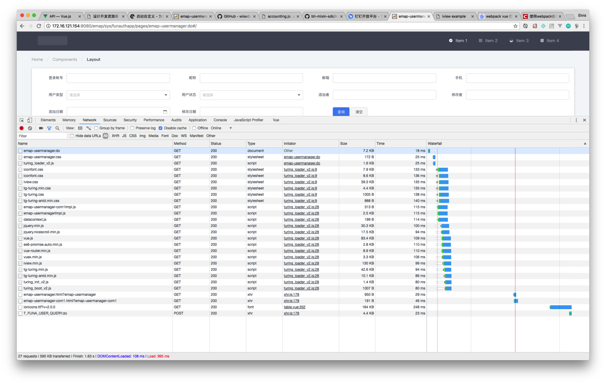

## 测试方法

抽样5次清空缓存硬加载页面

## 文件全分开加载

| 请求数 | 加载量 | Finish | DOM Loaded | Load |
| :--- | :--- | :--- | :--- | :--- |
| 27 | 595k | 1630ms | 108ms | 995ms |
| 27 | 595k | 2310ms | 469ms | 1560ms |
| 27 | 595k | 1920ms | 177ms | 1180ms |
| 27 | 595k | 1670ms | 113ms | 960ms |
| 27 | 595k | 2030ms | 181ms | 1290ms |

## 合并框架文件加载

| 请求数 | 加载量 | Finish | DOM Loaded | Load |
| :--- | :--- | :--- | :--- | :--- |
| 18 | 544k | 1830ms | 119ms | 1070ms |
| 18 | 544k | 1550ms | 144ms | 920ms |
| 18 | 544k | 1680ms | 123ms | 960ms |
| 18 | 544k | 2010ms | 214ms | 990ms |
| 18 | 544k | 1560ms | 121ms | 842ms |

## 效果

| 请求数(个) | 加载量KB | Finish(ms) | DOM Loaded(ms) | Load(ms) |
| :--- | :--- | :--- | :--- | :--- |
| 27 | 595 | 1912 | 209.6 | 1197 |
| 18 | 544 | 1726 | 144.2 | 956.4 |

* 请求数量减少：33%
* 加载量减少：8.57%
* 页面显示时间提速：20.1%
* 总体完成时间提速：9.73%

## 具体分析

从网络图中的 DOM Loaded -> Load（图中的蓝线 -> 红线），对应到性能图中的 蓝线 -> 红线，大约耗时770ms
其中最主要的是初始化： 耗时582ms
* iview.min.js = 275ms
* wisedu-vue.min.js = 180ms
* jquery + nicescroll = 57ms
* chrome插件中注入的jquery = 70ms

这部分是组件的初始化，这个过程与浏览器和主机CPU执行性能有关.

