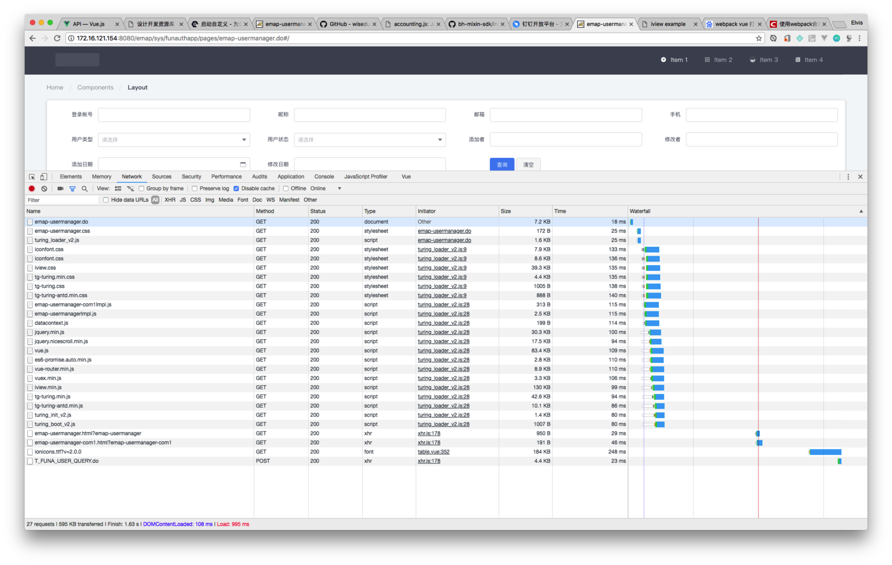
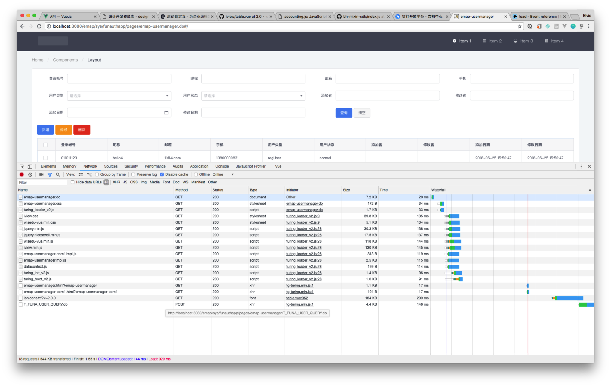
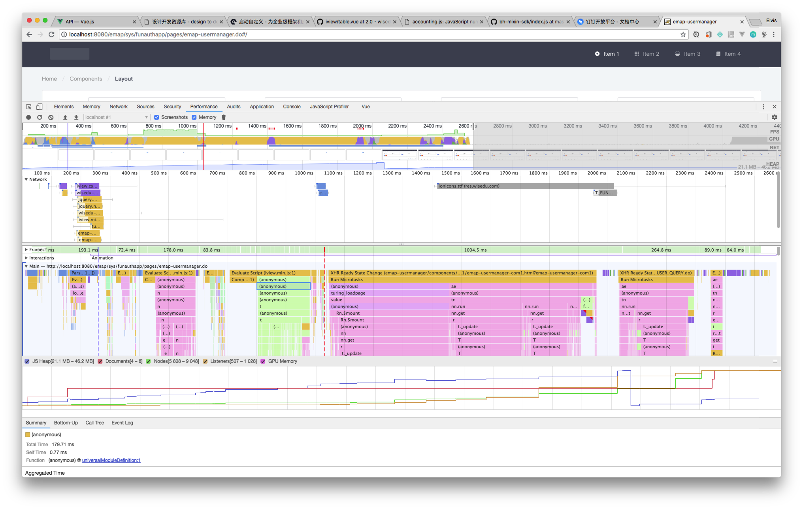
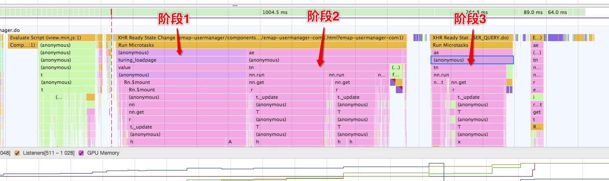

## 测试方法

测试的为1个模块：内置1个页面、1个组件，共计7个文件，约12kb加载量

抽样5次清空缓存硬加载页面

## 文件全分开加载

| 请求数 | 加载量 | Finish | DOM Loaded | Load |
| :--- | :--- | :--- | :--- | :--- |
| 27 | 595k | 1630ms | 108ms | 995ms |
| 27 | 595k | 2310ms | 469ms | 1560ms |
| 27 | 595k | 1920ms | 177ms | 1180ms |
| 27 | 595k | 1670ms | 113ms | 960ms |
| 27 | 595k | 2030ms | 181ms | 1290ms |

## 合并框架文件加载

| 请求数 | 加载量 | Finish | DOM Loaded | Load |
| :--- | :--- | :--- | :--- | :--- |
| 18 | 544k | 1830ms | 119ms | 1070ms |
| 18 | 544k | 1550ms | 144ms | 920ms |
| 18 | 544k | 1680ms | 123ms | 960ms |
| 18 | 544k | 2010ms | 214ms | 990ms |
| 18 | 544k | 1560ms | 121ms | 842ms |

## 效果

|  | 请求数(个) | 加载量KB | Finish(ms) | DOM Loaded(ms) | Load(ms) |
| :---| :--- | :--- | :--- | :--- | :--- |
| 分开 | 27 | 595 | 1912 | 209.6 | 1197 |
| 合并 | 18 | 544 | 1726 | 144.2 | 956.4 |

* 请求数量减少：33%
* 加载量减少：8.57%
* 页面显示时间提速：20.1%
* 总体完成时间提速：9.73%

## 具体分析

从网络图中的 DOM Loaded -> Load（图中的蓝线 -> 红线），对应到性能图中的 蓝线 -> 红线，大约耗时770ms

其中最主要的是初始化： 耗时582ms

* iview.min.js = 275ms
* wisedu-vue.min.js = 180ms
* jquery + nicescroll = 57ms
* chrome插件中注入的jquery = 70ms

这部分是组件的初始化定义，这个过程与浏览器和主机CPU执行性能有关。这部分的空白时间，增加了1kb的css loading动画，以尽快给予用户反馈

从 Load（红线）到 最后的 Finish，是页面组件实例化的过程，以及异步加载数据并填充到页面上的过程。

这部分的loading由各个异步组件自行处理，数据加载适配器以提供加载中的状态反馈

可以从 下图中标志的几个阶段来看所执行的内容
* 阶段1：初始化 Vue 实例
* 阶段2：异步更新 Vue 视图，显示出页面的表单、表格组件
* 阶段3：异步加载数据，填充回表格组件

## 结论与应对

### ubase

* 整个应用整体一个入口，运行加载时通过require.js分模块加载依赖文件。看起来加载量尽可能小，但任何一个模块需要引用的三方js，都必须在入口处全量加载（如：ueditor、echarts等）；
* 模块没有独立url，必须通过后端额外跳转（hash参数在IDS重定向时会被浏览器丢弃），以定位到某个前端路由上

### turing

* 每个模块一个入口，加载该模块中所有依赖的文件。三方js可以在需要的模块加载
* 每个模块都有独立的url，并可以在JSP中实现精细化调整

## 参考资料

* [Vue中DOM的异步更新策略以及nextTick机制详解](http://www.php.cn/js-tutorial-386849.html)
